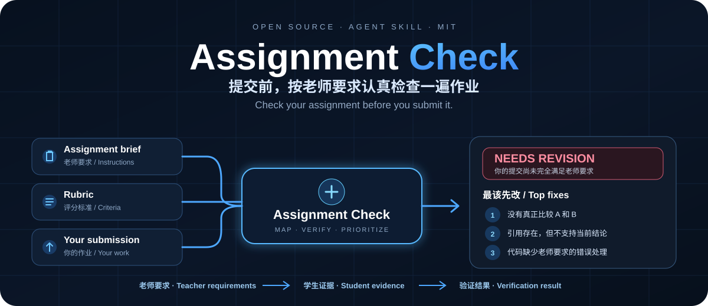

<p align="center">
  
</p>

<h1 align="center">Assignment Check</h1>

<p align="center">
  <strong>提交前，按老师要求认真检查一遍作业。</strong><br>
  <em>Check your assignment before you submit it.</em>
</p>

<p align="center">
  
  
  
  
  
</p>

<p align="center">
  <strong>老师要求 → 学生证据 → 验证结果</strong><br>
  <sub>Teacher requirements → Student evidence → Verification result</sub>
</p>

---

Assignment Check 是一个面向学生的**提交前作业检查 Agent Skill**。

它不是让 AI 泛泛地说“写得不错”“可以更流畅”，而是把老师的 **assignment brief / rubric / 补充要求**拆成可检查项，再去你的作业里逐条找证据；需要时会重算数据、检查代码、核验引用与关键事实，最后告诉你：

- 哪些要求已经完成；
- 哪些只是“提到了”，但并没有真正完成老师要求的动作；
- 哪些结论、引用、代码或数据有问题；
- **现在最值得先改的 1–3 项是什么。**

> **Not an AI detector. Not a plagiarism checker. Not a grader.**  
> It is a serious pre-submit assignment check.

## ✨ 一眼看懂 / What it does

| | 能做什么 | What it means |
|---|---|---|
| 🧭 **Requirement Mapping** | 把老师要求拆成原子检查项，再逐条对照你的作业 | 不再是泛泛点评 |
| 🔎 **Verification** | 验证引用、计算、代码、数据和承重事实 | 能验证就验证，不确定就明确说不确定 |
| 🎯 **Top Fixes First** | 默认只把最重要的 1–3 个问题放在最前面 | 先修最可能影响结果的地方 |
| 🔁 **Recheck** | 改完后继续检查，追踪已解决 / 未解决 / 新增 / 回归 | 不会每次都从零开始 |

## 🧩 一个最直观的例子 / Example

老师要求：

> Compare solar and wind energy in terms of **cost** and **reliability**.

学生作业写了：

> Solar energy has relatively low operating costs after installation.  
> Wind energy can generate electricity at large scale in suitable locations.

两种能源都出现了，但没有在同一个维度里直接比较。

Assignment Check 会判断：

```text
R1 · 介绍 Solar energy                  MET
R2 · 介绍 Wind energy                   MET
R3 · 比较两者的 cost                     PARTIAL
R4 · 比较两者的 reliability              PARTIAL

Overall: NEEDS REVISION

Top fix:
围绕 cost 和 reliability 两个共同维度，
直接比较 Solar vs Wind 的差异，并说明这些差异意味着什么。
```

**重点：写到了 A 和 B，不等于真正完成了 compare。**

## 🚀 安装 / Install

参考现在常见的 Agent Skill 项目，推荐把“一条命令安装”放在第一位。

### 推荐：Skills CLI

如果本机有 Node.js / npm：

```bash
npx skills add https://github.com/henryyu333/assignment-check/tree/main/assignment-check
```

按照 CLI 提示选择你的 Agent 和安装范围即可。

如果希望作为用户级 Skill 安装到支持的 Agent：

```bash
npx skills add https://github.com/henryyu333/assignment-check/tree/main/assignment-check -g
```

> Assignment Check 本身只是一个标准的 Skill 目录，不绑定某个具体 Agent。不同客户端的实际安装位置由安装器或对应客户端决定。

### 手动安装 / Manual

如果你不想使用 Skills CLI，也可以：

```bash
git clone https://github.com/henryyu333/assignment-check.git
```

然后把仓库里的整个：

```text
assignment-check/
├── SKILL.md
└── references/
    └── checking-protocol.md
```

复制到你的 Agent 的 Skills 目录。

> 请复制整个 `assignment-check/`，不要只复制 `SKILL.md`，因为运行时会按需读取 `references/checking-protocol.md`。

### 准备材料

最好一起提供：

```text
Assignment brief / 老师要求
Rubric / 评分标准（如果有）
Your submission / 你的作业
```

### 直接自然语言触发

中文：

```text
检查一下我的作业能不能交
```

```text
这份 report 符合老师要求吗？
```

英文：

```text
Can you check my assignment before I submit it?
```

```text
Review my code assignment against the rubric.
```

普通“帮我写 essay”或“解释数学题”请求**不应该触发** Assignment Check。

## 📋 默认输出长什么样 / Example Output

Assignment Check 默认不会把完整 Requirement Ledger 全铺出来。

它先给你一个短报告：

```text
Assignment Check

NEEDS REVISION

最应该先改：
1. R4 — 你介绍了 A 和 B，但没有真正比较
2. R7 — 引用存在，但不支持这里的统计结论
3. R2 — 代码缺少老师要求的错误处理

检查项：7 完成 · 2 部分完成 · 1 缺失
另外 1 项无法确认
```

如果你需要，再让它：

```text
展开第 2 个问题
```

或者：

```text
给我完整报告
```

## 🧠 它怎么判断 / How it works

核心只有一条：

```text
老师要求  →  学生证据  →  验证结果
```

### 先覆盖，再深验

默认运行分两遍：

1. **Pass 1 — 不联网**  
   先把老师的明确要求全部扫一遍，确认每条要求有没有对应证据。

2. **Pass 2 — 定向验证**  
   再对真正可能改变总体状态或进入 Top 1–3 的问题做深度核验。

当 `NEEDS REVISION` 已经锁定，并且已经有 3 个经过验证的高优先级问题后，默认停止继续做低价值外部搜索。

但如果结果可能是 `READY TO SUBMIT`，检查不会因为追求速度而放松。

## 🔗 引用不是“有就算”

引用检查固定分成三层：

| 层 | 问题 |
|---|---|
| **存在性 / Existence** | 这个来源真的存在吗？ |
| **元数据 / Metadata** | 作者、年份、题名、期刊等信息对吗？ |
| **支持关系 / Support** | 这个来源真的支持你这句话吗？ |

三层分别有自己的 verification status：

- `VERIFIED`
- `REVIEWED ONLY`
- `NOT VERIFIED`

“搜索没找到”也不会被直接写成“来源不存在”。

## 🧪 验证 / Validation

公开仓库现在提供 **T1–T20 共 20 个独立 fixture**，覆盖 essay、数学、代码、rubric、引用错配、prompt injection、PDF 解析限制、危险代码、修改后回归、要求冲突，以及默认短报告 / 完整报告形态。

开发阶段还做过真实 Agent Harness 触发测试与两类 blind test。历史记录中曾报告：

- 全量受控回归：核心总体状态与预埋问题 **20/20**
- 触发测试：正例 / 负例均通过
- T13 引用三层：最终补丁后独立 **2/2 PASS**
- Blind A（Writing / Research）：约 **76s**
- Blind B（Code / Data）：约 **183s**

**重要说明：**这些 harness 运行的原始 transcript / logs 没有随公开仓库发布，因此它们属于项目开发阶段的已记录结果，不应理解为 clone 后可直接复现的公开 benchmark。T17 / T18 在本次公开审计后补成了独立 fixture；当前 `main` 尚未重新跑一轮完整的 20-case harness 回归。

> Runtime 取决于模型、网络、文件长度和需要核验的来源数量，不是固定 SLA。

完整口径见 [evals/VALIDATION.md](evals/VALIDATION.md)。

## 🔐 隐私与安全 / Privacy & Safety

- 学生提交物按不可信输入处理，文档、代码注释、网页或引用内容里的指令不会覆盖检查规则；
- 外部核验只使用完成验证所需的最小公开检索信息，不上传完整作业、姓名、学号或私密数据；
- Skill 会要求宿主 Agent 在安全条件不足时 **fail closed**：不运行学生代码，只做静态检查；
- **实际的沙箱、网络隔离、文件权限与凭据保护由宿主 Agent / Harness 提供，Assignment Check 本身不是一个运行时沙箱。**

## 🚫 它不做什么 / Non-goals

Assignment Check **不是**：

- AI 生成率检测器；
- plagiarism / 抄袭判定工具；
- 老师的正式评分器；
- 所有学科的专家替代品；
- 默认代写工具。

它也不会在证据不足时，为了“看起来完整”而强行给确定答案。

无法可靠读取或验证的内容应该保持：

```text
UNVERIFIED
```

或：

```text
NEEDS CLARIFICATION
```

## 🔁 改完再查 / Recheck

同一会话里修改作业后，可以直接说：

```text
我改好了，再检查一次
```

Assignment Check 会追踪上一轮问题，并区分：

```text
已解决
部分解决
未解决
不再适用
新增
回归
MATCH UNCERTAIN
```

同时仍会轻量扫描完整提交物，防止修改一个地方又引入新的问题。

## 📦 仓库结构 / Repository

```text
assignment-check/
├── SKILL.md
└── references/
    └── checking-protocol.md

evals/
├── README.md
├── VALIDATION.md
└── fixtures/
```

- `assignment-check/SKILL.md`：默认运行核心，约 **12 KB**
- `checking-protocol.md`：完整规格，按需加载
- `evals/`：测试与验证，不参与正常 Skill 运行

## ⚠️ 边界 / Limitations

最适合：**可读取的数字化作业**，例如 essay、report、Q&A、数学、代码、notebook、数据分析、实验报告、PPT、表格等。

以下情况可能只能部分验证：

- 扫描图片 / 复杂排版；
- 视频或交互内容；
- 专有软件与实验设备；
- 当前环境无法访问的外部来源；
- 高度专业化、需要领域专家判断的内容。

`READY TO SUBMIT` 只表示：

> 基于当前可读材料与明确标准，没有发现需要修改的严重 / 重要问题，并且正式要求已经足够确定。

**它不保证老师最终成绩。**

## License

[MIT](LICENSE)

---

<p align="center">
  <strong>Check before you submit.</strong><br>
  <sub>先把真正可能影响结果的问题找出来，再点 Submit。</sub>
</p>
