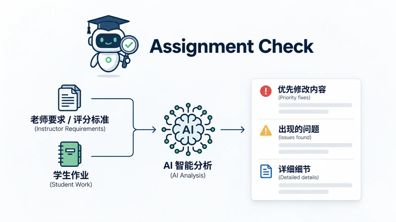

<p align="center">
  <a href="./README.md">简体中文</a> ·
  <a href="./README.en.md">English</a>
</p>

<p align="center">
  
</p>

<h1 align="center">Assignment Check</h1>

<p align="center">
  <strong>提交前，按老师要求认真检查一遍作业。</strong><br>
  <em>Check your assignment before you submit it.</em>
</p>

<p align="center">
  <a href="./LICENSE"></a>
  <a href="./assignment-check/SKILL.md"></a>
  <a href="./assignment-check/SKILL.md"></a>
  <a href="./assignment-check/SKILL.md"></a>
  <a href="./evals/README.md"></a>
</p>

<p align="center">
  <strong>老师要求 → 学生证据 → 验证结果</strong><br>
  <sub>Teacher requirements → Student evidence → Verification result</sub>
</p>

---

Assignment Check 是一个面向学生的**提交前作业检查 Agent Skill**。

它不是让 AI 泛泛地说“写得不错”“可以更流畅”，而是把老师的 **assignment brief / rubric / 补充要求**拆成可检查项，再去你的作业里逐条找证据；需要时会重算数据、检查代码、核验引用与关键事实，最后告诉你：

- 哪些要求已经完成；
- 哪些只是“提到了”，但并没有真正完成老师要求的动作；
- 哪些结论、引用、代码或数据有问题；
- **现在最值得先改的 1–3 项是什么。**

> **Not an AI detector. Not a plagiarism checker. Not a grader.**  
> It is a serious pre-submit assignment check.

## ✨ 一眼看懂 / What it does

| | 能做什么 | What it means |
|---|---|---|
| 🧭 **Requirement Mapping** | 把老师要求拆成原子检查项，再逐条对照你的作业 | 不再是泛泛点评 |
| 🔎 **Verification** | 验证引用、计算、代码、数据和承重事实 | 能验证就验证，不确定就明确说不确定 |
| 🎯 **Top Fixes First** | 默认只把最重要的 1–3 个问题放在最前面 | 先修最可能影响结果的地方 |
| 🔁 **Recheck** | 改完后继续检查，追踪已解决 / 未解决 / 新增 / 回归 | 不会每次都从零开始 |

## 🧩 一个最直观的例子 / Example

老师要求：

> Compare solar and wind energy in terms of **cost** and **reliability**.

学生作业写了：

> Solar energy has relatively low operating costs after installation.  
> Wind energy can generate electricity at large scale in suitable locations.

两种能源都出现了，但没有在同一个维度里直接比较。

Assignment Check 会先给学生一个直接可读的结果：

```text
⚠️ 建议修改后再提交

最应该先改

1. 还没有真正完成“比较”
老师要求从 cost 和 reliability 两个维度比较 Solar 和 Wind，
但你现在只是分别介绍了两者。
→ 用共同维度直接对照 Solar vs Wind，并说明差异意味着什么。

整体检查
△ 这两项比较要求目前只完成了一部分
```

**重点：写到了 A 和 B，不等于真正完成了 compare。**

## 🚀 安装 / Install

### 推荐：Skills CLI

如果本机有 Node.js / npm：

```bash
npx skills add https://github.com/henryyu333/assignment-check --skill assignment-check
```

按照 CLI 提示选择你的 Agent 和安装范围即可。

如果希望作为用户级 Skill 安装到支持的 Agent：

```bash
npx skills add https://github.com/henryyu333/assignment-check --skill assignment-check -g
```

> Assignment Check 本身只是一个标准的 Skill 目录，不绑定某个具体 Agent。不同客户端的实际安装位置由安装器或对应客户端决定。

### 手动安装 / Manual

如果你不想使用 Skills CLI，也可以：

```bash
git clone https://github.com/henryyu333/assignment-check.git
```

然后把仓库里的整个：

```text
assignment-check/
├── SKILL.md
└── references/
    └── checking-protocol.md
```

复制到你的 Agent 的 Skills 目录。

> 请复制整个 `assignment-check/`，不要只复制 `SKILL.md`，因为运行时会按需读取 `references/checking-protocol.md`。

### 准备材料

最好一起提供：

```text
Assignment brief / 老师要求
Rubric / 评分标准（如果有）
Your submission / 你的作业
```

### 直接自然语言触发

中文：

```text
检查一下我的作业能不能交
```

```text
这份 report 符合老师要求吗？
```

英文：

```text
Can you check my assignment before I submit it?
```

```text
Review my code assignment against the rubric.
```

普通“帮我写 essay”或“解释数学题”请求**不应该触发** Assignment Check。

## 📋 默认输出长什么样 / Example Output

默认情况下，Assignment Check 不会把内部 Requirement Ledger、`R4`、`MET`、`VERIFIED` 这些工程状态直接丢给学生。

它先给一份能直接看懂的提交前报告：

```text
Assignment Check

⚠️ 建议修改后再提交

最应该先改

1. 还没有真正完成“比较”
老师要求比较 A 和 B，但你现在只是分别介绍了它们。
→ 补一个共同维度，直接比较两者。

2. 一个引用没有支持你的结论
来源内容与这里的主张对不上。
→ 修改这句话，或换一个真正支持它的来源。

3. 漏了一个老师明确要求
Rubric 要求处理无效数据，目前代码直接跳过了。
→ 补上对应处理。

整体检查
✓ 已完成 7
△ 部分完成 2
✕ 缺失 1
? 暂时无法确认 1

改完后直接告诉我：
“我改好了，再检查一次。”
```

如果想看证据、Requirement ID、验证状态和每条老师要求，可以再说：

```text
给我完整报告
```

这时才展开完整 ledger 与技术状态。

## 🧠 它怎么判断 / How it works

核心只有一条：

```text
老师要求  →  学生证据  →  验证结果
```

### 先覆盖，再深验

默认运行分两遍：

1. **Pass 1 — 不联网**  
   先把老师的明确要求全部扫一遍，确认每条要求有没有对应证据。

2. **Pass 2 — 定向验证**  
   再对真正可能改变总体状态或进入 Top 1–3 的问题做深度核验。

当 `NEEDS REVISION` 已经锁定，并且已经有 3 个经过验证的高优先级问题后，默认停止继续做低价值外部搜索。

但如果结果可能是 `READY TO SUBMIT`，检查不会因为追求速度而放松。

## 🔗 引用不是“有就算”

引用检查固定分成三层：

| 层 | 问题 |
|---|---|
| **存在性 / Existence** | 这个来源真的存在吗？ |
| **元数据 / Metadata** | 作者、年份、题名、期刊等信息对吗？ |
| **支持关系 / Support** | 这个来源真的支持你这句话吗？ |

三层分别有自己的 verification status：

- `VERIFIED`
- `REVIEWED ONLY`
- `NOT VERIFIED`

“搜索没找到”也不会被直接写成“来源不存在”。

## 🧪 验证 / Validation

公开仓库提供 **T1–T20 共 20 个独立 fixture**，覆盖 essay、数学、代码、rubric、引用错配、prompt injection、PDF 解析限制、危险代码、修改后回归、要求冲突，以及默认短报告 / 完整报告形态。

仓库还保留开发阶段的历史 Harness / blind-test 记录，但原始 transcript 与 runner logs 未公开，因此这些记录**不作为当前可复现 benchmark**。当前可公开复核的是 fixture、验收口径与仓库内的轻量结构校验。

> Runtime 取决于模型、网络、文件长度和需要核验的来源数量，不是固定 SLA。

完整口径见 [evals/VALIDATION.md](evals/VALIDATION.md)。

## 🔐 隐私与安全 / Privacy & Safety

- 学生提交物按不可信输入处理，文档、代码注释、网页或引用内容里的指令不会覆盖检查规则；
- Assignment Check 不主动把完整作业、姓名、学号或私密数据发送给额外的第三方网站 / 服务；宿主 Agent、模型提供商如何处理文件与上下文，由各自的产品与隐私政策决定；
- 外部核验只使用完成验证所需的最小公开检索信息；
- Skill 会要求宿主 Agent 在安全条件不足时 **fail closed**：不运行学生代码，只做静态检查；
- **实际的沙箱、网络隔离、文件权限与凭据保护由宿主 Agent / Harness 提供，Assignment Check 本身不是一个运行时沙箱。**

## 🚫 它不做什么 / Non-goals

Assignment Check **不是**：

- AI 生成率检测器；
- plagiarism / 抄袭判定工具；
- 老师的正式评分器；
- 所有学科的专家替代品；
- 默认代写工具。

它也不会在证据不足时，为了“看起来完整”而强行给确定答案。

无法可靠读取或验证的内容不会被硬猜。默认学生报告会写成“暂时无法确认”，完整报告里才保留 `UNVERIFIED` / `NEEDS CLARIFICATION` 等技术状态。

## 🔁 改完再查 / Recheck

同一会话里修改作业后，可以直接说：

```text
我改好了，再检查一次
```

默认复查会更像学生能直接看的进度单：

```text
再次检查结果

✓ 上次：缺少真正比较 A 和 B → 已解决
△ 上次：引用支持不足 → 部分解决
✕ 上次：缺少样本量 → 还没解决

新发现：1 个问题

⚠️ 仍建议修改后再提交
```

内部仍会沿用原来的 finding ID；如果新旧问题无法可靠对应，默认会写成“暂时无法确认是不是同一个问题”，而不是把 `MATCH UNCERTAIN` 直接丢给普通用户。

同时仍会轻量扫描完整提交物，防止修改一个地方又引入新的问题。

## 📦 仓库结构 / Repository

```text
assignment-check/
├── SKILL.md
└── references/
    └── checking-protocol.md

evals/
├── README.md
├── VALIDATION.md
└── fixtures/

.github/workflows/
└── validate.yml
```

- `assignment-check/SKILL.md`：默认运行核心
- `checking-protocol.md`：完整规格，按需加载
- `evals/`：测试与验证，不参与正常 Skill 运行

## ⚠️ 边界 / Limitations

最适合：**可读取的数字化作业**，例如 essay、report、Q&A、数学、代码、notebook、数据分析、实验报告、PPT、表格等。

以下情况可能只能部分验证：

- 扫描图片 / 复杂排版；
- 视频或交互内容；
- 专有软件与实验设备；
- 当前环境无法访问的外部来源；
- 高度专业化、需要领域专家判断的内容。

`READY TO SUBMIT` 只表示：

> 基于当前可读材料与明确标准，没有发现需要修改的严重 / 重要问题，并且正式要求已经足够确定。

**它不保证老师最终成绩。**

## License

[MIT](LICENSE)

---

<p align="center">
  <strong>Check before you submit.</strong><br>
  <sub>先把真正可能影响结果的问题找出来，再点 Submit。</sub>
</p>
